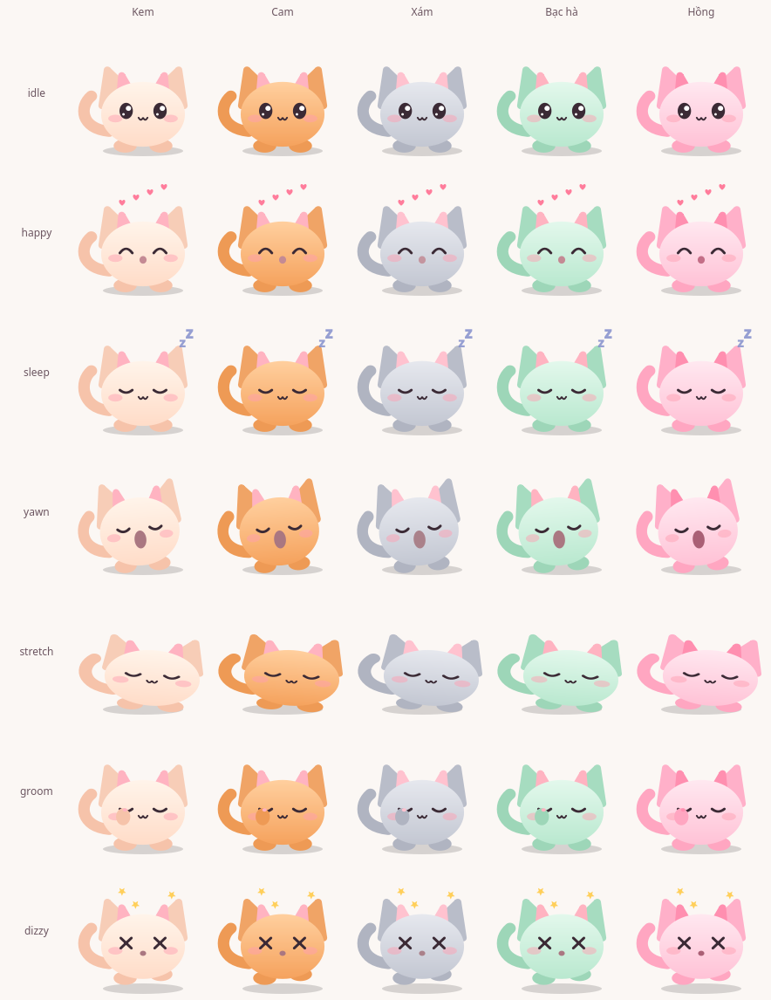
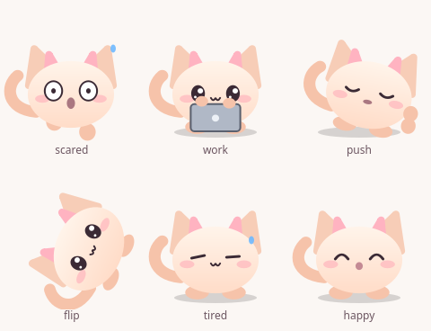

# desktop-pet

**Mochi** — một pet desktop nhỏ, nhẹ, vẽ hoàn toàn bằng vector (không cần sprite), dành cho KDE Plasma.





*Hai ảnh trên do chính bộ vẽ của Mochi render ra (không phải ảnh chụp màn hình). GIF quay từ màn hình thật: chưa có.*

## Tính năng

- Đi lại, ngồi, ngủ (có Zzz), chớp mắt, mắt nhìn theo con trỏ chuột
- Tự chọn ngẫu nhiên các động tác: ngáp, vươn vai, liếm chân, và chạy đuổi theo con trỏ
- Kéo thả để nhấc lên, thả ra thì rơi
- Ném được: hất chuột nhanh rồi thả, pet bay theo vận tốc, nảy khỏi cạnh màn hình/trần/sàn và mất dần năng lượng. Va rất mạnh thì chóng mặt (mắt chữ X, sao quay quanh đầu) và đi loạng choạng vài giây
- Đứng và đi trên đỉnh các cửa sổ (đi theo khi bạn kéo cửa sổ), thỉnh thoảng nhảy lên cửa sổ gần đó; không đứng trên cửa sổ đang bị cửa sổ khác che
- Bấm một lần: pet nhảy lên và bay trái tim (chờ 0,25 giây xem có bấm lần hai không). Bấm đúp: pet lộn một vòng 360° trên không
- Lắc mạnh pet khi đang giữ: pet chóng mặt ngay trong tay bạn
- Cửa sổ đang đứng biến mất (đóng, thu nhỏ, sang màn hình ảo khác): pet hoảng sợ (mắt tròn to, đạp chân, giọt mồ hôi) và rơi ngay
- Đi tới mép cửa sổ/màn hình, đôi khi pet nhắm mắt tì hai chân trước đẩy vào "bức tường" một lúc rồi quay lại hoặc ngồi xuống
- Click xuyên qua phần trong suốt quanh pet
- 5 màu (Kem, Cam, Xám, Bạc hà, Hồng), được nhớ cho lần chạy sau
- Bong bóng thoại: "Á!" khi hoảng sợ, thỉnh thoảng nói vu vơ, báo Pomodoro và thông báo từ chương trình khác. Có hàng đợi (tối đa 5), tự tắt sau vài giây, click xuyên qua, tự chọn bên trái/phải để không tràn màn hình
- Pomodoro: chuột phải → Pomodoro → Bắt đầu. Khi tập trung, Mochi ngồi gõ laptop nhỏ (Hà Nhân thì cầm biển đỏ cấm "BẬN" lắc lư: đang bận, đừng làm phiền); hết giờ thì có bong bóng, tiếng chuông và chuyển sang giờ nghỉ (tự đặt độ dài trong Cài đặt)
- Chỉ ngủ khi có lý do, không bao giờ ngủ ngẫu nhiên: lúc bạn khoá màn hình hoặc cho máy ngủ (thức dậy khi mở khoá, có lời chào), ngủ trưa từ 12:00 đến 13:30 và ngủ tối từ 22:00 đến 06:00 (giờ địa phương, chỉnh được trong Cài đặt). Vuốt ve thì nó dậy chơi rồi lại ngủ sau nửa phút; đang Pomodoro thì nó vẫn ngồi gõ laptop. Từ 22:00 nó còn bớt chạy đuổi
- Máy bận: nếu cài `psutil`, CPU trên 80% thì Mochi toát mồ hôi, đi chậm lại và giảm tốc độ vẽ; xuống dưới 65% mới hết (khoảng giữa hai ngưỡng để không nhấp nháy). Đọc CPU 8 giây một lần
- Chế độ yên lặng: không nói vu vơ, không âm thanh, giảm tốc độ vẽ khi đứng yên. Tự bật khi có ứng dụng toàn màn hình (KDE), tắt được trong Cài đặt
- Nhắc việc do bạn tự đặt: lặp lại sau mỗi N phút ("Uống nước đi!") hoặc hằng ngày vào giờ nhất định, chọn được các ngày trong tuần. Đến hạn Mochi nói câu nhắc bằng bong bóng, nhún nhảy và kêu chuông (trừ khi yên lặng hoặc tắt âm). Chuột phải → Nhắc việc...
- Chế độ: Bình thường, Làm việc (ngồi gõ laptop suốt, ít nói, không chạy đuổi), Chơi đùa (hiếu động, hay chạy đuổi), Ngủ (ngủ liền, tắt tiếng), Yên lặng; và bạn lưu được cài đặt hiện tại thành chế độ của riêng mình. Đổi nhanh ở chuột phải → Chế độ
- Màn hình nền: thả một file/icon lên Mochi thì nó phản ứng ("Nom nom! báo cáo.pdf ngon quá!"; nó không mở, không di chuyển, không xoá file); chuột phải → "Mở từ màn hình nền" liệt kê các mục trên desktop để Mochi mở giúp; thỉnh thoảng nó nhận xét về một mục nào đó
- Lời thoại hiện 2,5 đến 5 giây tuỳ độ dài
- Chuột phải: Màu / Chế độ / Pomodoro / Nhắc việc / Chế độ yên lặng / Cài đặt / Nhân vật / Mở từ màn hình nền / Ngủ / Gọi về / Tạm dừng / Tự chạy khi đăng nhập / Thoát

## Nền tảng hỗ trợ

| Môi trường | Trạng thái |
|---|---|
| KDE Plasma 6, Wayland (qua XWayland) | Đầy đủ: đi trên cửa sổ. Đã thử trên Fedora 44, Plasma 6.7, 2 màn hình (scale 1) |
| Linux khác (X11, GNOME…) | Chạy ở chế độ "floor-only": chỉ đi trên sàn màn hình. Chưa kiểm tra trên máy thật |
| Windows / macOS | Chưa hỗ trợ và chưa thử |

Chưa kiểm tra: fractional scaling và nhiều màn hình có scale khác nhau. Qt/XWayland xử lý toạ độ ở các trường hợp này khác nhau, nên pet có thể lệch vị trí so với cửa sổ.

## Cài đặt

Cần Python ≥ 3.10 và Linux. Chưa có bản phát hành dựng sẵn, nên hiện tại bạn tự build (một lệnh, khoảng 15 giây, cần mạng lần đầu):

```sh
git clone https://github.com/longtmb2003/desktop-pet
cd desktop-pet
scripts/build.sh                 # tạo dist/mochi/ (~160 MB, chạy được không cần cài Python)
scripts/install.sh --autostart   # cài cho riêng bạn vào ~/.local; bỏ --autostart nếu không muốn tự chạy khi đăng nhập
```

`install.sh` không cần quyền root. Nó chép ứng dụng vào `~/.local/opt/mochi`, tạo lệnh `mochi`, mục trong menu ứng dụng (không mở terminal) và icon. Nếu bạn từng tạo `~/.config/autostart/mochi-pet.desktop` theo cách chạy `pet.py` cũ, script sẽ đổi tên nó thành `.disabled` để khỏi chạy hai bản.

Tiến trình chạy nền có tên `mochi`, hiện đúng tên đó trong System Monitor (`pgrep -x mochi`). Mochi chỉ chạy một bản: chạy lần hai sẽ báo `already running` và thoát.

## Cài đặt

Chuột phải → **Cài đặt...** mở cửa sổ chỉnh: màu, tốc độ đi, tần suất hành vi, chạy đuổi, nói vu vơ, theo giờ trong ngày, âm thanh, theo dõi CPU, chế độ yên lặng (và tự bật khi toàn màn hình), tự chạy khi đăng nhập, độ dài Pomodoro, gọi Mochi về. Thay đổi có hiệu lực ngay và được nhớ (QSettings, `~/.config/mochi-pet/mochi.conf`). Giá trị hỏng trong file được thay bằng mặc định. Chưa có: đổi kích thước pet.

Theo dõi CPU cần `psutil` (bản build sẵn có kèm; chạy từ mã nguồn thì `pip install psutil` hoặc `pip install ".[monitor]"`). Không có psutil thì mọi thứ khác vẫn chạy bình thường.

## Nhắc việc, chế độ và màn hình nền

**Nhắc việc** lưu trong cài đặt (JSON, tối đa 30). Nhắc lặp lại tính bằng đồng hồ đơn điệu, nên máy ngủ đông không làm dồn cục các lần nhắc; nhắc hằng ngày trễ quá 5 phút thì bỏ qua thay vì nhắc muộn. Đang có ứng dụng toàn màn hình (và "Tự yên lặng" bật) thì lời nhắc đợi đến khi hết toàn màn hình.

**Chế độ** là một gói các cài đặt (tần suất, tốc độ, chạy đuổi, nói vu vơ, theo giờ, âm thanh, yên lặng) cộng với việc nghiêng về hành vi nào, hoặc giữ pet mãi ở một việc (ngủ / gõ laptop). Chọn chế độ thì các cài đặt đó được đặt lại theo chế độ; chỉnh tay sau đó vẫn được. Đang Pomodoro thì pet luôn ngồi gõ laptop bất kể chế độ.

**Màn hình nền**: KDE không cho biết icon nằm ở đâu trên màn hình, và Mochi không tự bật hỗ trợ tiếp cận (AT-SPI) của cả phiên làm việc chỉ để dò icon. Vì vậy Mochi làm việc với **nội dung thư mục desktop** (tên các mục, đọc `Name=` của lối tắt `.desktop`), không với vị trí. Nó không đi tới đứng cạnh từng icon.

## Nhân vật (pet) và gói nhân vật

Ngoài Mochi (vẽ bằng code), Mochi có thể hoá thân thành nhân vật khác: chuột phải → **Nhân vật**, hoặc trong Cài đặt. Liệt kê những gì có: `mochi pets`. Cỡ pet chỉnh trong Cài đặt (60% đến 200%).

Mỗi nhân vật là **dữ liệu**, không phải code: kích thước, tốc độ, hành vi hay làm (trọng số), câu hay nói, tiếng kêu khi mất chỗ đứng, cách vẽ. Nhân vật dạng ảnh ("sprite") là một thư mục có `pack.json` cùng vài file PNG, đặt trong `~/.local/share/mochi-pet/pets/<tên>/`:

```
pack.json        khai báo (xem bên dưới)
body.png         cả người, nền trong suốt, mép dưới chạm sàn, mặt để trống
faces/*.png      các khuôn mặt vẽ đè lên (nét mực trên nền trong suốt): neutral (bắt buộc), talk, laugh
```

```json
{"id": "hanhan", "name": "Hà Nhân", "size": 240, "feet": 232, "height": 200, "walk_speed": 42,
 "body": "body.png", "face": {"box": [69, 162, 198, 172]},
 "faces": {"neutral": ["faces/neutral_00.png"], "talk": ["faces/talk_00.png", "faces/talk_01.png"], "laugh": ["faces/laugh_00.png"]},
 "fps": {"talk": 12}, "behaviors": {"idle": 4, "walk": 4, "sleep": 1, "chase": 1, "rant": 2},
 "chatter": ["Làm việc đi!"], "scream": "Trời ơi!", "sway": 4, "bob": 5, "work_prop": "sign"}
```

Mochi chỉ đọc gói, không chạy code trong đó. Gói sai (thiếu ảnh, số lạ, đường dẫn chui ra ngoài thư mục) bị bỏ qua kèm cảnh báo, không làm Mochi hỏng. Ảnh chỉ được chuyển động bằng phép biến đổi (nhún, nghiêng, lộn, nằm xuống) và đổi mặt; biểu cảm ngủ và chóng mặt do Mochi tự vẽ lên khuôn mặt.

`scripts/make_hanhan.py` là ví dụ dựng một gói từ hai ảnh nguồn (cắt nền, xoá mặt gốc, biến bảng biểu cảm thành lớp mặt trong suốt). Hà Nhân là nhân vật hư cấu do AI tạo ra; ảnh nguồn nằm trong `packaging/` và gói đã dựng sẵn nằm trong `mochi/pets/packs/hanhan/`.

## API DBus cho chương trình khác

Mochi lắng nghe trên session bus, dịch vụ `org.mochi.Pet`, đường dẫn `/pet`, giao diện `org.mochi.Pet`:

| Phương thức | Việc làm |
|---|---|
| `showMessage(s)` | hiện bong bóng (bỏ ký tự điều khiển, tối đa 200 ký tự) |
| `setExpression(s)` | `normal`, `happy`, `dizzy`, `scared`, `tired`; từ chối khi pet đang bị kéo hoặc đang bay |
| `notifyTaskFinished(s)` | bong bóng "Xong rồi: …", pet nhảy mừng, chuông (trừ khi yên lặng hoặc tắt âm) |
| `startPomodoro(i)` | bắt đầu tập trung `i` phút (1 đến 180) |
| `setMode(s)` | đổi chế độ theo tên hoặc id (`normal`, `work`, `play`, `sleep`, `quiet`, hoặc chế độ của bạn) |

Mỗi phương thức trả `true` nếu đã thực hiện, `false` nếu bị từ chối (đầu vào sai, hoặc quá 20 lời gọi trong 10 giây). Ví dụ:

```sh
gdbus call --session --dest org.mochi.Pet --object-path /pet \
  --method org.mochi.Pet.notifyTaskFinished "make -j8"
make -j8 && gdbus call --session --dest org.mochi.Pet --object-path /pet --method org.mochi.Pet.showMessage "Build xong"
```

Bất kỳ tiến trình nào trong phiên của bạn đều gọi được API này (giống mọi dịch vụ session bus), nên nó chỉ làm những việc vô hại: hiện chữ, đổi biểu cảm, bắt đầu đồng hồ.

## Tự chạy khi đăng nhập

Bật/tắt bằng menu chuột phải ("Tự chạy khi đăng nhập") hoặc dòng lệnh:

```sh
mochi autostart on       # tạo ~/.config/autostart/mochi.desktop
mochi autostart off
mochi autostart status
```

## Gỡ cài đặt

```sh
scripts/uninstall.sh             # gỡ ứng dụng, lệnh, menu, icon và autostart
scripts/uninstall.sh --purge     # như trên, và xoá luôn cài đặt đã lưu (màu…)
```

Hoặc chỉ dừng Mochi mà giữ lại: chuột phải → Thoát (hoặc `pkill -x mochi`).

## Phát triển

```sh
python3 -m venv .venv && . .venv/bin/activate
pip install -e ".[dev]"
python -m mochi                  # chạy từ mã nguồn (`python3 pet.py` cũ vẫn chạy, nhưng chỉ là lối tắt)
ruff check . && mypy mochi && pytest
```

Test chạy không cần màn hình (`QT_QPA_PLATFORM=offscreen`). CI (GitHub Actions) chạy ruff, mypy, pytest và một smoke test khởi động trên Python 3.10 và 3.13.

```
mochi/
├── app.py        điểm vào, dòng lệnh (`mochi autostart …`)
├── pet.py        widget: hành vi, vòng lặp vật lý theo thời gian thực, chuột, menu
├── pets/         định nghĩa nhân vật (dữ liệu) và bộ đọc gói ảnh (pack.py)
├── sprite.py     vẽ nhân vật dạng ảnh: chuyển động bằng phép biến đổi, vùng click
├── state.py      Motion × Expression × Action, thời lượng, quy tắc chuyển trạng thái (kể cả theo giờ)
├── physics.py    hình học thuần (bề mặt, cửa sổ bị che, nhảy), ném/nảy, phát hiện lắc; không phụ thuộc Qt
├── bubble.py     bong bóng thoại: cửa sổ riêng, hàng đợi, chọn vị trí
├── pomodoro.py   đồng hồ Pomodoro (logic thuần, đồng hồ tiêm được)
├── monitor.py    đọc CPU (psutil tuỳ chọn) và hysteresis
├── api.py        API DBus công khai (kiểm tra đầu vào, giới hạn tần suất)
├── settings_dialog.py  cửa sổ Cài đặt
├── reminders.py  lịch nhắc việc (logic thuần, đồng hồ tiêm được); reminders_dialog.py là cửa sổ chỉnh
├── modes.py      chế độ (có sẵn và của riêng bạn)
├── desktop.py    các mục trên màn hình nền (tên, mở)
├── sound.py      tiếng chuông
├── renderer.py   vẽ vector, màu, vùng click
├── settings.py   lưu cài đặt (QSettings)
├── autostart.py  mục autostart XDG
└── platform/     nguồn thông tin cửa sổ: base (chỉ sàn) và kde (KWin qua DBus, kwin.js)
```

Build lại icon / ảnh xem trước: `python scripts/make_icon.py`, `python scripts/make_preview.py`.

## Cách hoạt động và quyền truy cập thông tin cửa sổ

- Trên Wayland, app thường không được tự đặt vị trí cửa sổ, nên Mochi ép Qt chạy qua XWayland (`QT_QPA_PLATFORM=xcb`), và chỉ làm vậy khi có `WAYLAND_DISPLAY`.
- Để biết vị trí các cửa sổ khác, Mochi nạp `kwin.js` vào KWin qua DBus. Script này chạy **bên trong KWin**, nên có quyền đọc mọi cửa sổ, nhưng nó chỉ gửi cho Mochi **id nội bộ và toạ độ/kích thước** của các cửa sổ thường đang hiển thị (không gửi tiêu đề, nội dung hay tên ứng dụng), theo thứ tự xếp chồng, và chỉ khi có thay đổi.
- Dữ liệu đi qua session bus tại dịch vụ `org.mochi.Pet`. Bất kỳ tiến trình nào trong phiên của bạn cũng gọi được dịch vụ này, nên Mochi kiểm tra từng bản tin (bỏ mục sai, từ chối bản tin không phải danh sách, giới hạn log) và không bao giờ bị crash vì dữ liệu xấu.
- Khi thoát bình thường, Mochi gỡ script khỏi KWin. Nếu bị crash, script còn sót sẽ được gỡ ở lần chạy sau.
- Giới hạn của KWin API: chỉ các cửa sổ `normalWindow` được xét; popup, panel, tooltip không tính. Cửa sổ rộng dưới 80 px không dùng làm chỗ đứng.
- Ngoài KDE hoặc khi KWin/DBus không có, pet vẫn chạy và chỉ đi trên sàn màn hình.

## Xử lý sự cố

| Triệu chứng | Cách xử lý |
|---|---|
| `mochi: already running` | Đã có một bản đang chạy. Dừng nó: `pkill -x mochi` |
| Pet không đứng lên cửa sổ | Kiểm tra script đã nạp: `gdbus call --session --dest org.kde.KWin --object-path /Scripting --method org.kde.kwin.Scripting.isScriptLoaded mochi` phải in `(true,)`. Chạy `mochi` từ terminal để xem log |
| `Could not load the Qt platform plugin "xcb"` | Thiếu thư viện hệ thống: Fedora `sudo dnf install xcb-util-cursor`, Debian/Ubuntu `sudo apt install libxcb-cursor0` |
| Pet kẹt ngoài màn hình | Chuột phải → "Gọi về". Nếu không chạm được vào pet: `pkill -x mochi` rồi chạy lại. Khi rút màn hình, pet tự về màn hình chính |
| Không có KDE | Bình thường: chế độ floor-only, chỉ đi trên sàn |

## Lộ trình

- **v0.2:** ổn định, tách kiến trúc, đóng gói. (xong)
- **v0.3:** ném pet bằng chuột (quán tính), va chạm cạnh màn hình, chóng mặt, lắc, double-click lộn vòng, hoảng sợ khi cửa sổ biến mất, đẩy tường. (xong)
- **v0.4:** bong bóng thoại, Pomodoro, phản ứng theo giờ/CPU, API DBus, cửa sổ Cài đặt và chế độ yên lặng. (xong)
- **v0.5:** nhân vật là dữ liệu: đổi được giữa Mochi và các gói ảnh (như Hà Nhân), mỗi nhân vật có cỡ, tốc độ, hành vi, lời thoại riêng; chỉnh cỡ pet. Chưa có: nhiều pet chạy cùng lúc. (xong)
- **v0.6 (bản này):** nhắc việc tự đặt, chế độ có sẵn và tự tạo, tương tác với các mục trên màn hình nền (thả file, mở, nhận xét), lời thoại lâu hơn.

## License

MIT
